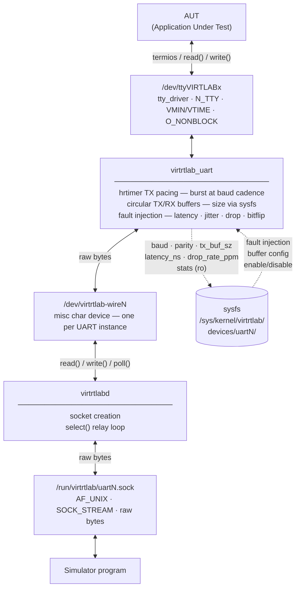

# VirtRTLab

VirtRTLab is a Linux/POSIX real-time testing framework based on **kernel modules** that simulate common peripherals on a **virtual bus**.

The `v0.1.0` MVP focuses on **UART** and **GPIO** as two deliberately different validation paths:

- UART validates streamed I/O, termios behaviour, pacing, buffering, and daemon-mediated simulator connectivity
- GPIO validates discrete state transitions, direction changes, and event-oriented control paths

The next milestone, `v0.2.0`, prioritizes **SPI**, **ADC**, and **DAC** to introduce higher-throughput paths and DMA-oriented scenarios.

Goal: run an application-under-test (AUT) *as if it were connected to real hardware*, while VirtRTLab provides:

- Peripheral discovery via sysfs
- Runtime fault injection via sysfs (latency, jitter, drops, bit flips)
- CI-oriented scenarios that help surface **race conditions, deadlocks, priority inversion, starvation**, and other timing-sensitive bugs

This document defines **v1 naming and interface conventions** so modules and tooling stay consistent.

---

## 1) Naming conventions

### Project and prefixes

- Project name: **VirtRTLab**
- Kernel prefix (symbols, modules, Kconfig): `VIRTRTLAB` / `virtrtlab_…`
- Sysfs namespace: `virtrtlab`
- Userspace control naming:
  - CLI: `virtrtlabctl`
  - Sockets (per device): `/run/virtrtlab/uart0.sock`, `/run/virtrtlab/uart1.sock`, …
  - State dir: `/run/virtrtlab/`

### Module names

One core module + multiple peripheral modules:

- Core:
  - `virtrtlab_core` (virtual bus + common infra)
- Peripherals:
  - `virtrtlab_uart`
  - `virtrtlab_gpio`
  - `virtrtlab_spi`
  - `virtrtlab_adc`
  - `virtrtlab_dac`
  - (future) `virtrtlab_can`, `virtrtlab_i2c`, …

### Object naming

- Bus instance: `vrtlbus<N>` (e.g. `vrtlbus0`)
- Device instance: `<type><N>` (e.g. `uart0`, `gpio0`, `spi0`, `adc0`, `dac0`)
- TTY device node: `/dev/ttyVIRTLAB<N>` (AUT-facing; N matches the device index)
- Wire device node: `/dev/virtrtlab-wire<N>` (daemon-facing; N matches the device index)
- Daemon socket: `/run/virtrtlab/<type><N>.sock` (e.g. `uart0.sock`)

### Module parameters

- `virtrtlab_uart`: `num_uarts` (int, default `1`, range `1..8`) — number of UART instances to register at load time. Instance indices are **0-based**: with `num_uarts=2`, instances are N=0 and N=1, producing `uart0`, `uart1`, `/dev/ttyVIRTLAB0`, `/dev/ttyVIRTLAB1`, `/dev/virtrtlab-wire0`, `/dev/virtrtlab-wire1`.

---

## 2) Architecture (v1)

### Data path (UART example)



### Control path

Fault injection and device configuration are done exclusively via **sysfs**:

- Arm a fault: `echo 500000 > /sys/kernel/virtrtlab/devices/uart0/latency_ns`
- Observe termios state: `cat /sys/kernel/virtrtlab/devices/uart0/baud`

`virtrtlabctl` is a thin sysfs convenience wrapper and a `virtrtlabd` lifecycle manager.

### Components

| Component | Role |
|---|---|
| `virtrtlab_core` | Virtual bus (`vrtlbus<N>`), kobject tree, `version` attr |
| `virtrtlab_uart` | TTY driver + misc wire device + hrtimer pacing + fault engine |
| `virtrtlab_gpio` | GPIO-oriented peripheral model for direction/state/edge validation |
| `/dev/ttyVIRTLABx` | AUT-facing interface — standard termios / O_NONBLOCK |
| `/dev/virtrtlab-wireN` | Raw byte pipe from kernel to daemon (misc char device) |
| `virtrtlabd` | Daemon for streamed peripherals in `v0.1.0` (UART first) — socket creation, select() relay |
| `/run/virtrtlab/uart0.sock` | Raw SOCK_STREAM byte channel to/from the simulator for UART-class devices |
| `virtrtlabctl` | CLI — sysfs get/set, stats, daemon lifecycle |

### Repository layout (target for `v0.1.0`)

`v0.1.0` is considered complete only when the repository contains the full vertical slice: kernel modules, daemon, CLI, and centralized tests.

```text
.
|-- docs/
|   |-- README.md
|   |-- socket-api.md
|   `-- sysfs.md
|-- kernel/
|   |-- include/
|   |-- virtrtlab_core.c
|   |-- virtrtlab_uart.c
|   `-- virtrtlab_gpio.c
|-- tests/
|   |-- README.md
|   |-- kernel/
|   |-- daemon/
|   |-- cli/
|   |-- helpers/
|   `-- fixtures/
`-- userspace/
  |-- README.md
  |-- virtrtlabd.py
  `-- virtrtlabctl.py
```

---

## 3) sysfs layout

VirtRTLab exposes a stable sysfs API. The recommended layout is under `/sys/kernel/virtrtlab/` (kobject-based) to keep it decoupled from any specific subsystem.

### Root

`/sys/kernel/virtrtlab/`

- `version` (ro): semantic version string, e.g. `0.1.0`
- `buses/`
- `devices/`

### Bus instances

`/sys/kernel/virtrtlab/buses/vrtlbus0/`

- `state` (rw): `up|down|reset`
- `clock_ns` (ro): monotonic timestamp sampled by core
- `seed` (rw): RNG seed for stochastic profiles

### Devices

`/sys/kernel/virtrtlab/devices/uart0/`

Common files (all device types):

- `type` (ro): `uart|gpio|spi|adc|dac|…`
- `bus` (ro): `vrtlbus0`
- `enabled` (rw): `0|1`
- `latency_ns` (rw): base TX latency added to every transfer (nanoseconds)
- `jitter_ns` (rw): uniform jitter amplitude (nanoseconds)
- `drop_rate_ppm` (rw): drops per million bytes/frames
- `bitflip_rate_ppm` (rw): bit flips per million bytes/frames
- `stats/` (ro): per-device counters (type-specific; see below)

> `mode` (normal/record/replay) and `fault_policy` are **not** exposed in sysfs — record/replay and policy orchestration are handled in userspace scripts.

Type-specific examples:

- UART (`/sys/kernel/virtrtlab/devices/uart0/`)
  - `baud` (ro): mirror of termios speed, e.g. `115200`
  - `parity` (ro): `none|even|odd` — mirror of termios PARENB/PARODD
  - `databits` (ro): `5|6|7|8` — mirror of termios CS5..CS8
  - `stopbits` (ro): `1|2` — mirror of termios CSTOPB
  - `tx_buf_sz` (rw): TX circular buffer size in bytes (default: `4096`)
  - `rx_buf_sz` (rw): RX circular buffer size in bytes (default: `4096`)
  - `stats/tx_bytes`, `stats/rx_bytes`, `stats/overruns`, `stats/drops` (ro)
  - `stats/reset` (wo): write `0` to reset all counters atomically

- GPIO (`…/gpio0/`)
  - `direction` (rw): `in|out`
  - `value` (rw/ro): `0|1`
  - `active_low` (rw): `0|1`
  - `edge` (rw): `none|rising|falling|both`
  - `stats/value_changes`, `stats/edge_events` (ro)

- SPI (`…/spi0/`)
  - `mode` (rw): `0|1|2|3`
  - `max_hz` (rw)

- ADC (`…/adc0/`)
  - `channels` (ro)
  - `sample_rate_hz` (rw)
  - `noise_uV_rms` (rw)

- DAC (`…/dac0/`)
  - `channels` (ro)
  - `slew_limit_uV_per_us` (rw)

---

## 4) Wire device and daemon socket

### Wire device

Each UART instance exposes a misc char device:

- `/dev/virtrtlab-wire0` (uart0), `/dev/virtrtlab-wire1` (uart1), …

The wire device is a **raw byte pipe** between `virtrtlab_uart` (kernel) and the `virtrtlabd` daemon. It supports `read()`, `write()`, `poll()`/`select()`.

The kernel applies fault injection (latency, jitter, drop, bitflip) **before** delivering bytes to the wire device.

### Daemon socket

`virtrtlabd` creates one UNIX socket per device:

- `/run/virtrtlab/uart0.sock` (`AF_UNIX`, `SOCK_STREAM`, raw bytes)
- `/run/virtrtlab/uart1.sock`, …

The simulator connects and exchanges raw bytes — no framing, no length prefix. `virtrtlabd` relays bytes between the wire device and the socket using `select()`.

### Control

There is **no control channel on the socket**. Fault injection, buffer sizes, and device stats are all accessed via sysfs (see Section 3).

### Testing with socat

```sh
# Connect to the simulated UART (after virtrtlabd is running)
socat - UNIX-CONNECT:/run/virtrtlab/uart0.sock

# Loopback test: relay bytes between two instances
# (requires a userspace relay — see docs/socket-api.md)
```

---

## 5) CLI conventions (`virtrtlabctl`)

Command structure:

- Discovery:
  - `virtrtlabctl list buses`
  - `virtrtlabctl list devices`
- Sysfs convenience:
  - `virtrtlabctl get uart0 baud`
  - `virtrtlabctl set uart0 latency_ns=500000`
  - `virtrtlabctl set uart0 drop_rate_ppm=20000`
  - `virtrtlabctl stats uart0` — display all stats counters for uart0
  - `virtrtlabctl reset uart0` — reset stats counters only (equivalent to writing `0` to `stats/reset`); for a full device reset including fault attrs and `enabled`, write `reset` to the bus `state` attr
- Daemon lifecycle:
  - `virtrtlabctl daemon start`
  - `virtrtlabctl daemon stop`
  - `virtrtlabctl daemon status`

Output rules:

- Human-readable by default
- `--json` for machine parsing
- Exit codes:
  - `0` success
  - `2` invalid args
  - `3` daemon/socket error
  - `4` kernel attribute write rejected

---

## 6) Determinism and CI guidelines

To make CI results meaningful:

- Make stochastic behavior reproducible with an explicit RNG seed:
  - Write `seed` on the bus kobject before activating fault injection
  - Record the seed value in CI artifacts alongside stats
- Always export stats at the end of a test run:
  - `virtrtlabctl stats uart0 --json > artifacts/virtrtlab-stats.json`

Recommended CI pattern:

1. Boot test image / VM (or container with privileged kernel access)
2. Load modules (`virtrtlab_core` + needed peripherals)
3. Load the `v0.1.0` MVP stack (`virtrtlab_uart`, `virtrtlab_gpio`, `virtrtlabd`, `virtrtlabctl`); the bus `vrtlbus0` and devices register automatically at `module_init()`
4. Run centralized tests from `tests/` under different VirtRTLab fault profiles
5. Collect logs + VirtRTLab stats + kernel traces (ftrace, lockdep, perf sched)
6. Export machine-readable test results for GitHub Actions artifacts and annotations

---

## 7) Roadmap and MVP scope

`v0.1.0` is the MVP and must be a **complete** vertical slice:

- Kernel:
  - `virtrtlab_core` — virtual bus, kobject tree, `version` sysfs attr
  - `virtrtlab_uart` — streamed peripheral reference path: TTY, wire device, pacing, fault injection
  - `virtrtlab_gpio` — discrete signal reference path: direction, value, edge-oriented behaviour
- Userspace:
  - `virtrtlabd` — daemon for streamed-device socket bridging
  - `virtrtlabctl` — CLI for discovery, sysfs convenience, stats, and daemon lifecycle
- Validation:
  - centralized `tests/` tree covering kernel, daemon, and CLI behaviour

`v0.2.0` priorities:

- `virtrtlab_spi`, `virtrtlab_adc`, `virtrtlab_dac`
- higher-throughput paths, sustained buffering pressure, and DMA-oriented scenarios
- first data-heavy replay/profile capabilities where they serve throughput validation

Deferred backlog after `v0.2.0`:

- `virtrtlab_can`, `virtrtlab_i2c`, and other bus families
- advanced flow-control variants and tracepoints for injected faults
- broader CI stress campaigns once the MVP stack is stable

## 8) Test strategy

The recommended approach is a **single `tests/` tree** driven primarily by **Python** test orchestration, with a small number of focused **C helper programs** for low-level kernel-facing behaviour.

Why this choice:

- Python is the most practical layer for orchestrating `insmod`/`rmmod`, sysfs writes, daemon lifecycle, socket setup, timeouts, log capture, and GitHub Actions reporting
- low-level contract checks such as `termios`, `poll()`, blocking vs `O_NONBLOCK`, and GPIO edge timing are easier to exercise accurately with tiny C helpers than with pure Python shims
- adding CMake/CTest now would introduce a second build system without solving a concrete problem that `pytest` and a small test-local helper build cannot already cover

Recommended split:

- `tests/kernel/` — integration tests that drive the loaded modules from userspace and validate observable behaviour via sysfs, device nodes, and logs
- `tests/daemon/` — relay and reconnect tests for `virtrtlabd`, including socket lifecycle, backpressure handling, and disconnect cleanup
- `tests/cli/` — subprocess tests for `virtrtlabctl`, human-readable output, `--json`, and exit-code behaviour
- `tests/helpers/` — small C programs for UART termios/poll semantics, GPIO edge consumers, and precise timing probes
- `tests/fixtures/` — reusable pytest fixtures, test data, and expected-output samples

GitHub Actions shape:

1. Fast userspace checks on hosted runners: CLI parsing, daemon unit tests with mocks/fakes, documentation sanity
2. Kernel integration on a privileged VM or self-hosted runner: module load/unload, sysfs behaviour, UART and GPIO contract tests
3. Artifact collection: `dmesg`, per-device stats, daemon logs, and JUnit XML from the test runner

See `tests/README.md` for the repository-level test layout.

---

## 9) Decisions

**Safety / permissions** — decided:
- sysfs fault injection attrs (`latency_ns`, `drop_rate_ppm`, etc.) require no kernel capability beyond standard filesystem permissions; access is controlled by the sysfs file mode (root-owned, `0644`). No `CAP_SYS_ADMIN` required.
- `/dev/virtrtlab-wireN`, `/run/virtrtlab/` and its sockets are owned `root:virtrtlab` (mode `0660`). The `virtrtlabd` process and any monitoring tool must run as root or as a member of the `virtrtlab` group.
- The AUT itself never touches the wire device or the sockets directly; it only opens `/dev/ttyVIRTLABx` (world-readable by default for TTY devices).

**Backpressure when `latency_ns` exceeds buffer capacity** — follows the **16550 model**:
- **TX buffer** (AUT → wire device): never evicts bytes. When full, `write_room()` returns `0`; the AUT's `write()` **blocks** (or returns `-EAGAIN` with `O_NONBLOCK`). `stats/overruns` is NOT incremented for TX.
- **RX buffer** (wire device → AUT): evicts the **oldest byte** on overflow and increments `stats/overruns`. This models a hardware FIFO overrun.

**Flow control** — not part of the `v0.1.0` MVP and no longer a priority driver for `v0.2.0`; it stays in the backlog until UART/GPIO MVP behaviour and the SPI/ADC/DAC throughput path are stable.

**Baud rate change notification** — not in v0.1.0: `tcsetattr()` updates termios state and the sysfs `baud` attr. `virtrtlabd` may poll `baud` via sysfs on demand; no uevent or wire-device control byte is generated.

**Buffer live-resize** — deferred to v0.2.0: `tx_buf_sz`/`rx_buf_sz` writes are rejected while the device is open (`-EBUSY`).

**Multi-connection socket** — single active connection per device socket: a second `connect()` attempt is rejected. No observer mode in v0.1.0.

**Automatic reconnect after simulator disconnect** — flush and stay: on simulator `close()`, `virtrtlabd` discards undelivered TX bytes and returns to `listen()` without restarting.

**Module unload while device open** — `rmmod virtrtlab_uart` while `/dev/ttyVIRTLABx` or `/dev/virtrtlab-wireN` is open returns `-EBUSY`. The TTY subsystem holds a refcount on the `tty_driver` while any TTY fd is open; the wire misc device checks `try_module_get()` at `open()` time and releases the reference at `release()`. Forced unload (`rmmod -f`) is explicitly unsupported.

**PRNG scope** — one xorshift32 state per bus (`buses/vrtlbus0/seed`), shared across all devices on that bus. Devices draw from the bus-level PRNG in interleaved order. Each device does not have its own PRNG state.

---

## License

TBD
